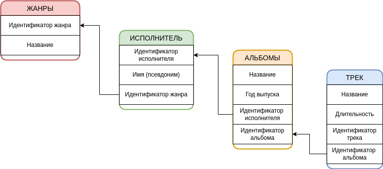
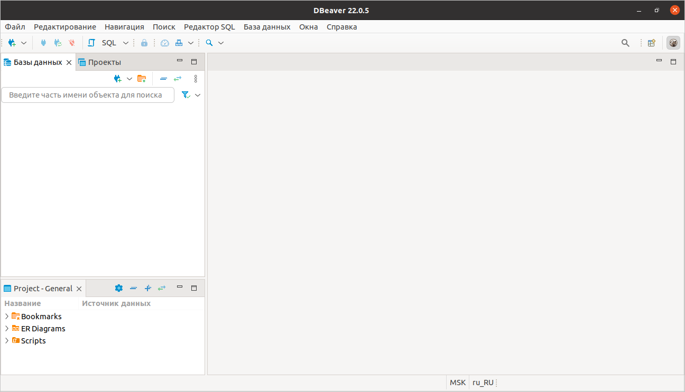

# Домашнее задание к лекции «Введение в БД. Типы БД»

## Задание 1 (практика)

Спроектировать схему (таблицы и связи между ними) для музыкального сайта. Требования:

- На сайте должна быть возможность увидеть список музыкальных жанров.
- Для каждого жанра можно получить список исполнителей, которые исполняют в соответствующем жанре.
- Для каждого исполнителя можно получить список его альбомов.
- Для каждого альбома можно получить список треков, которые в него входят.
- У жанра есть название.
- У исполнителя есть имя (псевдоним) и жанр, в котором он исполняет.
- У альбома есть название, год выпуска и его исполнитель.
- У трека есть название, длительность и альбом, которому этот трек принадлежит.

Результатом работы является изображение в формате PNG, содержащее схему БД.

Для создания схем можно воспользоваться удобной платформой [app.diagrams.net](https://app.diagrams.net/) или любым другим графическим редактором.

[Краткая шпаргалка](https://docs.google.com/document/d/1KUagjHQQHIQYS2-qI0lgiV2wNxKdi00Q_Xw0nK7t3PA/edit?usp=sharing) по созданию схем БД на платформе [app.diagrams.net](https://app.diagrams.net/).

Ответ:



## Задание 2 (подготовка к следующей лекции)

Необходимо установить PostgreSQL на свой ПК.

### Windows

[Видео-инструкция](https://embed.new.video/uyjUq9B3qYo6BbbkzG71Ny)

[Ссылка на PostgreSQL для Windows](https://www.enterprisedb.com/downloads/postgres-postgresql-downloads)

### Linux (на примере Ubuntu 20.04)

[Видео-инструкция](https://embed.new.video/cRQW4Z2YnxZUxzKRLWwnPF)

Команды для установки:

```bash
# PostgreSQL
sudo apt update && sudo apt install postgresql-12

# pgAdmin4
wget --quiet -O - https://www.postgresql.org/media/keys/ACCC4CF8.asc | sudo apt-key add -
echo "deb http://apt.postgresql.org/pub/repos/apt/ `lsb_release -cs`-pgdg main" |sudo tee  /etc/apt/sources.list.d/pgdg.list
sudo apt update && sudo apt install pgadmin4
```

### PostgreSQL
```shell
tatyanix@tatyanix-toshiba:~# psql -V
psql (PostgreSQL) 12.11 (Ubuntu 12.11-0ubuntu0.20.04.1)
```

### pgAdmin4 
с представленными командами не установился.
Вот с такими командами установился:

```shell
curl https://www.pgadmin.org/static/packages_pgadmin_org.pub | sudo apt-key add
sudo sh -c 'echo "deb [arch=amd64] https://ftp.postgresql.org/pub/pgadmin/pgadmin4/apt/focal/ pgadmin4 main" > /etc/apt/sources.list.d/pgadmin4.list && apt update'
apt install pgadmin4
```

### Mac OS X

[Видео-инструкция](https://kinescope.io/200639959)

Команды для установки:

```bash
brew install postgres

postgres -V

pg_ctl -D /usr/local/var/postgres start

createuser -P -s postgres
```

## Задание 3 (подготовка к следующей лекции)

На следующей лекции мы будем использовать программу DBeaver Community для работы с СУБД. Это бесплатная программа, вы можете заранее скачать ее [по ссылке](https://dbeaver.io/download/) и установить на свой компьютер.

Обратите внимание, что данное задание является рекомендацией, для полноценного участия в лекции DBeaver вам не потребуется, вы можете установить эту программу позже (или даже вообще использовать что-то другое).

